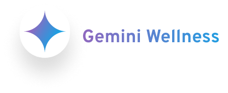

## 

This is the Client repository for the Gemini Wellness project, built using React and Tailwind CSS. The chatbot aims to provide accessible and culturally sensitive mental health support through a conversational interface trained on Gemini.

## Features

- Clean and responsive UI built with React and Tailwind CSS
- Interactive chatbot interface for mental health assessments and support
- Culturally sensitive responses tailored to user backgrounds
- Conversational therapy approach with active listening and validation
- Resource library with reputable mental health information and support links

## Getting Started

### Prerequisites

- Node.js and npm installed on your machine

### Installation

1. Clone this repository:

```bash
git clone https://github.com/Kevin-ishimwe/Gemini-wellness.git
```

2. Navigate to the project directory:

```bash
 cd Gemini-wellness
```

3. Install dependencies:

```bash
npm install
```

### Development

- To start the development server, run:

```bash
npm run dev
```

This will start the development server at http://localhost:5173/

- To host project on local network

```bash
npm run host
```

### Building for Production

To build the production-ready optimized bundle, run:

```bash
npm run build
```

The built files will be located in the dist folder.

### Other scripts and their usages

- npm run lint is used to format and check for linting errors files

## Project Structure

```tree
├── public/
│   └── vite.svg
├── src/
│   ├── assets/
│   ├── components/
│   ├── css/
│   ├── fonts/
│   ├── pages/
│   │   └── Home.jsx
│   ├── App.jsx
│   └── main.jsx
├── index.html
├── package.json
├── package-lock.json
├── postcss.config.js
├── tailwind.config.js
└── vite.config.js
```

## Contributing

Contributions are welcome! Please follow the standard GitHub workflow:

1. Fork the repository
2. Create a new branch for your feature or bugfix
3. Commit your changes
4. Push to your fork
5. Create a pull request against the main repository

# Collaborators

Big thank you to

- [@Kevin Ishimwe](https://github.com/Kevin-ishimwe)

# License

This project is licensed under the MIT License.
Acknowledgments

# Technologies

To successfully navigate the codebase of the project, you will need undertanding
of the following technologies that are being used to develop this application:

- [Vite docs](https://vitejs.dev/guide/)
- [React](https://react.dev/learn)
- [Tailwind docs](https://tailwindcss.com/docs/installation)
